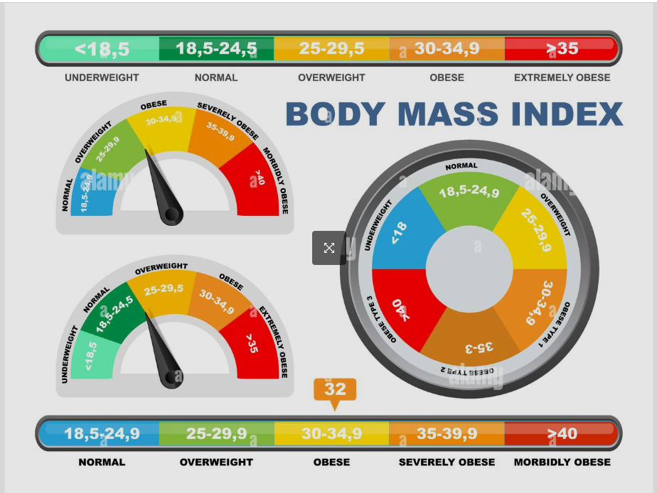
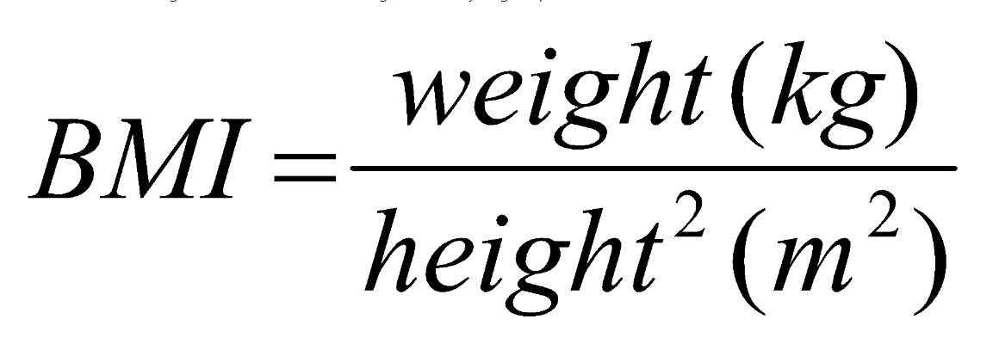

# Project : BMI Calculator

## Check The Live Website ➡️ [Live Website](https://skycooper.github.io/BMICalculator/)

## Visualization of the Website

## Description

Project aims to create a BMI calculator app.

## Learning Outcomes

At the end of the this project, you will be able to;

- analyze a problem,

- demonstrate your knowledge of algorithmic design principles,

- create a BMI calculator.

## Project Skeleton 

|----BMI Calculator

        |----index.html  
        |----style.css   
        |----app.js
        |----images
        |----readme.md 

### Overview
I mastered HTML, CSS and Javascript features in this project. You can see the visual representation of the website above.

## Resources
- 🔥 You can use [Images](./images) for your own work.
